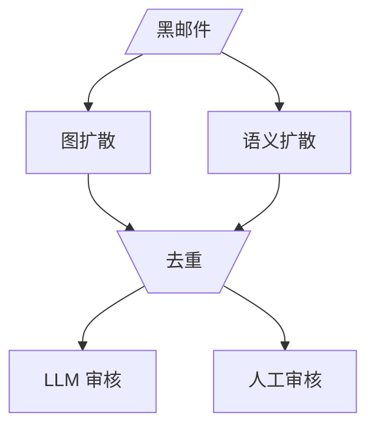
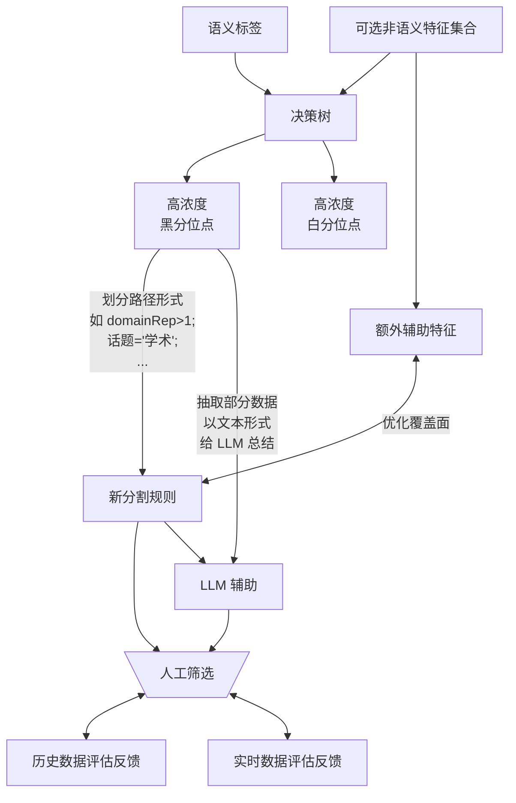

---
aliases:
cssclasses:
ReviewedDate: "[[Daily_Notes/14-09-24]]"
tags:
  - my/summary
  - state/process
  - coremail
  - my/project
child:
---

## 黑样本扩散

背景：unseen 的新型攻击（主要是钓鱼？）因为数量稀少，**人为加规则**能“准” 的及时补锅，但是有可能 **覆盖面有限**。

思路：学习风控产业的灰名单生成的方法，运用相似度扩散来抓更多可疑的邮件 （sender）

方法：根据已知黑邮件扩散生成灰邮件, 类似推荐系统的协同过滤/多路召回

- 语义扩散
  - top sparse 匹配
    - bm25: tf-idf term weights
    - splade: learning based term weights
  - top dense 匹配
    - Bert
  - top 混合匹配
    - m3-embedding
  - top 模板匹配？
- 图扩散 (图扩散是双向图)

  - sender -> ip
  - sender -> ip
  - sender -> ip -> 语义topic
  - sender -> url1 -> url2 -> ... -> url_end
    - 解释：已知黑 url 根据跳转路径传播

- 扩散后 去重（md5，url，content 用 minhash, 完整内容用 tlsh）
  - LLM 审核
  - 人工审核

流程图如下：

扩展：

- tag7 匹配 订阅邮件 --> 能挖掘到攻击者在模仿什么邮件
- ...

## 结合语义话题的半自动规则挖掘

tag:

- 0: 高置信度白邮件
- 1: 高置信度黑邮件
- 2: 灰邮件

和之前展示流程不一样的地方: 抓黑不抓白

审核员工作时对着这棵树：

- 每一个叶子点就对应了一个规则
- 点击节点
  - 可以添加规则，看到节点中覆盖面的改变
  - 可以让 llm 总结节点内数据，挖掘决出 refine 的特征（如关键字）

![[LAB34--Domain_ClusterId_tree_index4.excalidraw.svg]]

## Reference
